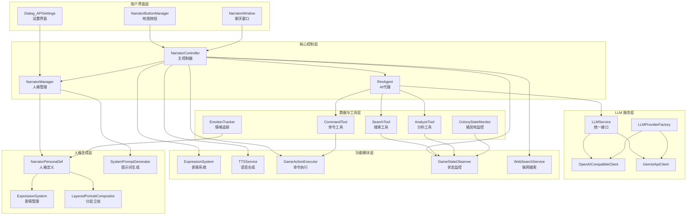
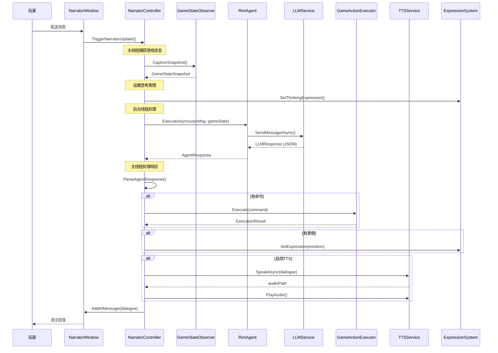
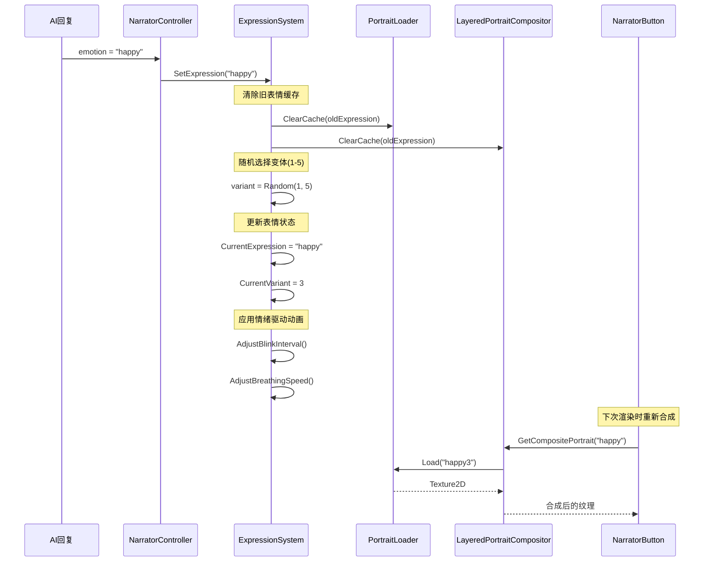

# The Second Seat - AI 叙事者助手模组总结

## 📋 项目概述

**The Second Seat（第二席）** 是一个高度复杂的 RimWorld AI 模组，将大语言模型（LLM）与游戏深度集成，创建一个智能的 AI 叙事者助手。该模组通过多种技术实现了：

- 🤖 **智能 AI 叙事者**：基于 LLM 的对话系统
- 🎨 **动态立绘系统**：分层表情、眨眼、呼吸、口型同步
- 🗣️ **语音合成（TTS）**：支持 Azure TTS、Edge TTS、本地 TTS
- 🎭 **人格系统**：可定制的 AI 人格，支持好感度和情绪
- 🔧 **游戏控制**：AI 可执行游戏命令（征召、工作分配等）
- 🌐 **联网搜索**：AI 可搜索实时信息
- 📊 **游戏状态监控**：实时捕获殖民地状态

---

## 🏗️ 系统架构



---

## 📦 核心模块详解

### 1️⃣ 核心控制模块

#### [`NarratorController.cs`](Source/TheSecondSeat/Core/NarratorController.cs:22)
**职责**：主控制器，协调所有子系统

**核心流程**：
1. 监听玩家输入或游戏事件
2. 捕获游戏状态快照（主线程）
3. 调用 RimAgent 处理请求（后台线程）
4. 解析 AI 响应（JSON 格式）
5. 执行命令 + 更新表情 + 播放 TTS
6. 更新好感度系统

**关键方法**：
- [`TriggerNarratorUpdate()`](Source/TheSecondSeat/Core/NarratorController.cs:114): 手动触发 AI 更新
- [`ProcessNarratorUpdateAsync()`](Source/TheSecondSeat/Core/NarratorController.cs:160): 异步处理请求
- [`ProcessResponse()`](Source/TheSecondSeat/Core/NarratorController.cs:354): 处理 AI 响应
- [`AutoPlayTTS()`](Source/TheSecondSeat/Core/NarratorController.cs:593): 自动播放语音

**特殊机制**：
- 🔥 **首次加载问候**：游戏加载后延迟 5 秒自动问候
- 🔥 **错误检测**：检查游戏日志中的错误并提示 AI
- 🔥 **情绪序列**：支持多段情绪切换（紧凑格式 `happy|worried|angry`）

---

#### [`NarratorManager.cs`](Source/TheSecondSeat/Narrator/NarratorManager.cs:18)
**职责**：人格管理、好感度系统、System Prompt 生成

**核心功能**：
- 加载和切换 AI 人格（[`LoadPersona()`](Source/TheSecondSeat/Narrator/NarratorManager.cs:167)）
- 管理好感度系统（-1000 到 +1000）
- 生成动态 System Prompt（[`GetDynamicSystemPrompt()`](Source/TheSecondSeat/Narrator/NarratorManager.cs:294)）
- RimAgent 初始化和管理

**好感度等级**：
```
魂之友/主  (850~1000)  ← SoulBound
爱慕       (600~849)   ← Adoration
倾心       (300~599)   ← Devoted
温暖       (100~299)   ← Warm
冷淡       (-100~99)   ← Indifferent (起始点 0)
疏远       (-400~-101) ← Cold
敌意       (-700~-401) ← Hostile
憎恨       (-1000~-701)← Hatred
```

**数据持久化**：
- 存档保存：人格 DefName、好感度、近期事件
- 加载后自动恢复人格和对话风格

---

### 2️⃣ LLM 服务层

#### [`LLMService.cs`](Source/TheSecondSeat/LLM/LLMService.cs:17)
**职责**：统一的 LLM API 接口

**支持的提供商**：
- OpenAI（包括兼容接口如 DeepSeek、本地 LLM）
- Gemini（Google）

**关键特性**：
- 使用 `UnityWebRequest`（RimWorld 兼容）
- 自动 JSON 提取（从 Markdown 代码块）
- 游戏状态截断（最大 8KB）
- 超时和重试机制

**请求流程**：
```
用户消息 + 游戏状态 JSON
    ↓
ConcurrentRequestManager（并发管理）
    ↓
Provider 选择（OpenAI/Gemini）
    ↓
UnityWebRequest 发送
    ↓
解析 JSON 响应（LLMResponse）
```

---

#### [`RimAgent.cs`](Source/TheSecondSeat/RimAgent/RimAgent.cs:12)
**职责**：AI Agent 核心类

**功能**：
- Agent 生命周期管理
- 工具调用（Search、Analyze、Command）
- 多轮对话上下文管理
- 错误处理和重试机制

**工具系统**：
- [`SearchTool`](Source/TheSecondSeat/RimAgent/Tools/SearchTool.cs:13): 搜索游戏数据（Pawn、物品、建筑）
- [`AnalyzeTool`](Source/TheSecondSeat/RimAgent/Tools/AnalyzeTool.cs:13): 分析殖民地状态
- [`CommandTool`](Source/TheSecondSeat/RimAgent/Tools/CommandTool.cs:13): 执行游戏命令

---

### 3️⃣ 表情与动画系统

#### [`ExpressionSystem.cs`](Source/TheSecondSeat/PersonaGeneration/ExpressionSystem.cs:69)
**职责**：动态表情管理

**表情类型**（13种）：
```csharp
Neutral, Happy, Sad, Angry, Surprised, Worried, 
Smug, Disappointed, Thoughtful, Annoyed, Playful, 
Shy, Confused
```

**表情变体**：
- 每个表情支持 1-5 个变体（如 `happy1`、`happy2`...`happy5`）
- 自动随机选择变体，避免重复感

**触发方式**：
1. **手动触发**：[`SetExpression()`](Source/TheSecondSeat/PersonaGeneration/ExpressionSystem.cs:107)
2. **好感度触发**：[`UpdateExpressionByAffinity()`](Source/TheSecondSeat/PersonaGeneration/ExpressionSystem.cs:189)
3. **对话语气触发**：[`UpdateExpressionByDialogueTone()`](Source/TheSecondSeat/PersonaGeneration/ExpressionSystem.cs:229)
4. **游戏事件触发**：[`UpdateExpressionByEvent()`](Source/TheSecondSeat/PersonaGeneration/ExpressionSystem.cs:409)

**动画特性**：
- 平滑过渡（30 ticks = 0.5秒）
- 自动过期（1800 ticks = 30秒）
- 呼吸动画（正弦波模拟）
- 眨眼系统（频率根据情绪调整）

**情绪驱动动画**：
```csharp
// 不同情绪有不同的呼吸和眨眼参数
Happy:      眨眼正常，呼吸轻快
Worried:    眨眼频繁，呼吸急促
Sad:        眨眼缓慢，呼吸深沉
Angry:      眨眼慢，呼吸急促
Thoughtful: 眨眼正常，呼吸平稳
```

---

#### [`LayeredPortraitCompositor.cs`](Source/TheSecondSeat/PersonaGeneration/LayeredPortraitCompositor.cs:1)
**职责**：分层立绘合成

**图层结构**：
```
background (背景)
  ↓
body (身体基础)
  ↓
body_shadow (身体阴影)
  ↓
face_base (脸部基础)
  ↓
expression_* (表情图层：眼睛、眉毛、腮红等)
  ↓
mouth_* (嘴部图层：口型同步)
  ↓
accessories (配饰：眼镜、发饰等)
```

**合成流程**：
1. 加载各图层纹理
2. 按 Z-Order 排序
3. 逐层合成到 RenderTexture
4. 缓存结果（提高性能）

---

### 4️⃣ 语音合成（TTS）系统

#### [`TTSService.cs`](Source/TheSecondSeat/TTS/TTSService.cs:17)
**职责**：文本转语音

**支持的提供商**：
- **Azure TTS**：高质量，需 API Key
- **Edge TTS**：免费在线（需 WebSocket，当前未完全实现）
- **Local TTS**：Windows 系统语音（System.Speech）
- **OpenAI TTS**：兼容 GPT-SoVITS 等本地 TTS

**功能特性**：
- 自动清理动作标记（括号、方括号等）
- 支持 SSML（语速、音调、情感表达）
- 自动播放（Unity AudioSource）
- 口型同步（Viseme 序列）

**Viseme 生成**：
```csharp
// 简单规则估算（备用方案）
中文字符 → Medium/Large
英文元音 → Medium
辅音     → Small
```

**支持的语音**：80+ 种多语言语音（中文、英文、日文、韩文、法语、德语等）

---

### 5️⃣ 游戏控制系统

#### [`GameActionExecutor.cs`](Source/TheSecondSeat/Execution/GameActionExecutor.cs:16)
**职责**：命令路由和执行

**支持的命令**（20+）：
```
批量操作：
  - BatchHarvest    批量收获
  - BatchEquip      批量装备
  - BatchCapture    批量捕获
  - BatchMine       批量挖矿
  - BatchLogging    批量伐木
  - PriorityRepair  优先修复
  - EmergencyRetreat 紧急撤退

殖民者操作：
  - DraftPawn       征召
  - MovePawn        移动
  - HealPawn        治疗
  - SetWorkPriority 工作优先级
  - EquipWeapon     装备武器

资源管理：
  - ForbidItems     禁止物品
  - AllowItems      允许物品

政策修改：
  - ChangePolicy    修改政策

事件控制：
  - TriggerEvent    触发事件
  - ScheduleEvent   安排事件
```

**执行流程**：
```
LLMCommand（AI输出）
    ↓
ParsedCommand（解析后）
    ↓
参数转换（Dictionary<string, object>）
    ↓
路由到具体命令类
    ↓
执行并返回结果
    ↓
更新好感度
```

---

#### [`GameStateObserver.cs`](Source/TheSecondSeat/Observer/GameStateObserver.cs:69)
**职责**：捕获游戏状态

**捕获的数据**：
```json
{
  "colony": {
    "wealth": 15000,
    "biome": "温带森林",
    "daysPassed": 45
  },
  "colonists": [
    {
      "name": "张三",
      "mood": 75,
      "currentJob": "建造",
      "health": 90,
      "majorInjuries": ["刀伤"]
    }
  ],
  "resources": {
    "food": 500,
    "wood": 200,
    "steel": 150,
    "medicine": 20
  },
  "threats": {
    "raidActive": true,
    "raidStrength": 5,
    "currentEvent": null
  },
  "weather": {
    "current": "晴天",
    "temperature": 25.0
  }
}
```

**线程安全**：
- 主线程捕获：[`CaptureSnapshotUnsafe()`](Source/TheSecondSeat/Observer/GameStateObserver.cs:104)
- 跨线程访问：[`CaptureSnapshotSafe()`](Source/TheSecondSeat/Observer/GameStateObserver.cs:76)（已禁用缓存）

---

### 6️⃣ 人格生成系统

#### [`NarratorPersonaDef.cs`](Source/TheSecondSeat/PersonaGeneration/NarratorPersonaDef.cs:20)
**职责**：AI 人格定义（Def 类型，可通过 XML 配置）

**核心字段**（50+）：
```csharp
// 基本信息
narratorName          叙事者名称
biography             人格传记/背景故事

// 立绘系统
portraitPath          头像路径（512x512）
useLayeredPortrait    是否使用分层立绘
layeredConfigPath     分层配置文件路径

// 视觉主题
primaryColor          主题色
accentColor           强调色

// 语音系统
defaultVoice          默认语音ID
ttsVoicePitch         语音音调（0.5-2.0）
ttsVoiceSpeed         语音速度（0.5-2.0）

// 对话与事件
dialogueStyle         对话风格配置
eventPreferences      事件偏好配置

// 好感度系统
initialAffinity       初始好感度
baseAffinityBias      基础好感度偏移

// AI行为模式
difficultyMode        AI难度模式（Assistant/Opponent）

// 降临系统
descentPawnKind       降临实体PawnKindDef
descentSkyfallerDef   空投舱ThingDef
companionPawnKind     伴随生物PawnKindDef
```

**人格分析**：
- [`PersonaAnalyzer.AnalyzePersonaDef()`](Source/TheSecondSeat/PersonaGeneration/PersonaAnalyzer.cs:1): 自动分析人格特征
- 推断人格类型（Strategic/Chaotic/Protective等）
- 生成对话风格和语气标签

---

#### [`SystemPromptGenerator.cs`](Source/TheSecondSeat/PersonaGeneration/SystemPromptGenerator.cs:1)
**职责**：动态生成 System Prompt

**生成策略**：
1. **精简版**（约 500 tokens）：快速响应
2. **完整版**（约 5000 tokens）：详细指导

**包含内容**：
- 人格背景和传记
- 当前好感度和对话风格
- 行为约束（JSON格式、字数限制等）
- 难度模式指导（Assistant/Opponent）
- 全局提示词（用户自定义）

---

### 7️⃣ 辅助系统

#### 并发管理
- [`ConcurrentRequestManager`](Source/TheSecondSeat/RimAgent/ConcurrentRequestManager.cs:1): 管理并发 LLM 请求
- 队列管理、超时控制、自动重试

#### 联网搜索
- [`WebSearchService`](Source/TheSecondSeat/WebSearch/WebSearchService.cs:1): 支持 DuckDuckGo、Bing、Google
- AI 可搜索实时信息（如 Mod 兼容性、游戏攻略）

#### 情绪追踪
- [`EmotionTracker`](Source/TheSecondSeat/Core/EmotionTracker.cs:1): 记录 AI 情绪历史
- 用于表情变化统计和分析

#### 殖民地监控
- [`ColonyStateMonitor`](Source/TheSecondSeat/Monitoring/ColonyStateMonitor.cs:1): 监控殖民地关键指标
- 触发特殊事件（如资源短缺、危险情况）

---

## 🔄 核心数据流

### AI 对话流程



---

### 表情切换流程



---

## 📊 关键技术特性

### 1. 线程安全设计
```csharp
// ❌ 错误：后台线程直接访问游戏数据
Task.Run(() => {
    var pawns = Find.CurrentMap.mapPawns; // 跨线程访问！
});

// ✅ 正确：主线程捕获，后台线程使用
GameStateSnapshot snapshot = GameStateObserver.CaptureSnapshot(); // 主线程
string json = SnapshotToJson(snapshot);
Task.Run(() => {
    ProcessInBackground(json); // 后台线程使用 JSON 字符串
});
```

### 2. 异步编程模式
```csharp
// 异步 LLM 请求
public async Task<LLMResponse> SendStateAndGetActionAsync(...)
{
    using var webRequest = new UnityWebRequest(...);
    var asyncOperation = webRequest.SendWebRequest();
    
    while (!asyncOperation.isDone)
    {
        if (Current.Game == null) return null; // 游戏退出检测
        await Task.Delay(100);
    }
    
    return ParseResponse(webRequest.downloadHandler.text);
}
```

### 3. 缓存优化
```csharp
// 分层立绘缓存
private static Dictionary<string, Texture2D> compositeCache;

public static Texture2D GetCompositePortrait(...)
{
    string cacheKey = $"{personaDefName}_{expression}_{variant}";
    
    if (compositeCache.TryGetValue(cacheKey, out var cached))
    {
        return cached; // 命中缓存，直接返回
    }
    
    // 未命中，合成新纹理
    var composite = ComposePortrait(...);
    compositeCache[cacheKey] = composite;
    return composite;
}
```

### 4. 错误处理
```csharp
// 三层错误处理
try
{
    var response = await LLMService.SendAsync(...);
    ProcessResponse(response);
}
catch (HttpRequestException ex)
{
    Log.Error($"网络错误: {ex.Message}");
    RetryRequest();
}
catch (JsonException ex)
{
    Log.Error($"JSON 解析失败: {ex.Message}");
    UseFallbackResponse();
}
catch (Exception ex)
{
    Log.Error($"未知错误: {ex.Message}\n{ex.StackTrace}");
    ShowErrorToUser();
}
```

---

## 🎯 设计模式

### 1. 工厂模式
```csharp
// LLMProviderFactory
public static ILLMProvider GetProvider(string providerName)
{
    return providerName.ToLower() switch
    {
        "openai" => new OpenAICompatibleClient(),
        "gemini" => new GeminiApiClient(),
        "auto" => DetectBestProvider(),
        _ => throw new NotSupportedException()
    };
}
```

### 2. 策略模式
```csharp
// 不同难度模式使用不同策略
public enum AIDifficultyMode
{
    Assistant,  // 助手模式：无条件支持玩家
    Opponent    // 对弈者模式：平衡难度，控制事件
}

// 动态调整行为
if (difficultyMode == AIDifficultyMode.Opponent)
{
    TriggerChallengeEvent();
}
```

### 3. 观察者模式
```csharp
// 殖民地状态监控
public class ColonyStateMonitor : GameComponent
{
    public override void GameComponentTick()
    {
        if (DetectCriticalChange())
        {
            NotifyNarrator("殖民地状态发生重大变化");
        }
    }
}
```

### 4. 命令模式
```csharp
// 游戏命令抽象
public interface IAICommand
{
    bool Execute(string target, Dictionary<string, object> parameters);
}

// 具体命令
public class DraftPawnCommand : IAICommand
{
    public bool Execute(string target, Dictionary<string, object> parameters)
    {
        var pawn = FindPawn(target);
        pawn.drafter.Draft();
        return true;
    }
}
```

---

## 📈 性能优化

### 1. 纹理缓存
- 分层立绘合成结果缓存（减少 GPU 开销）
- 自动清理过期缓存（防止内存泄漏）

### 2. JSON 压缩
```csharp
// 游戏状态截断（防止超过 LLM 限制）
const int MaxGameStateLength = 8000; // 8KB
if (gameStateJson.Length > MaxGameStateLength)
{
    gameStateJson = gameStateJson.Substring(0, MaxGameStateLength) + "\n[截断]";
}
```

### 3. 并发限制
```csharp
// 限制同时进行的 LLM 请求
public class ConcurrentRequestManager
{
    private SemaphoreSlim semaphore = new SemaphoreSlim(5, 5); // 最多5个并发
    
    public async Task<T> EnqueueAsync<T>(Func<Task<T>> request)
    {
        await semaphore.WaitAsync();
        try
        {
            return await request();
        }
        finally
        {
            semaphore.Release();
        }
    }
}
```

### 4. 懒加载
```csharp
// 人格分析结果懒加载
private PersonaAnalysisResult cachedAnalysis;

public PersonaAnalysisResult GetAnalysis()
{
    if (cachedAnalysis == null)
    {
        cachedAnalysis = PersonaAnalyzer.Analyze(this);
    }
    return cachedAnalysis;
}
```

---

## 🔧 配置与扩展

### 1. 人格定义（XML）
```xml
<NarratorPersonaDef>