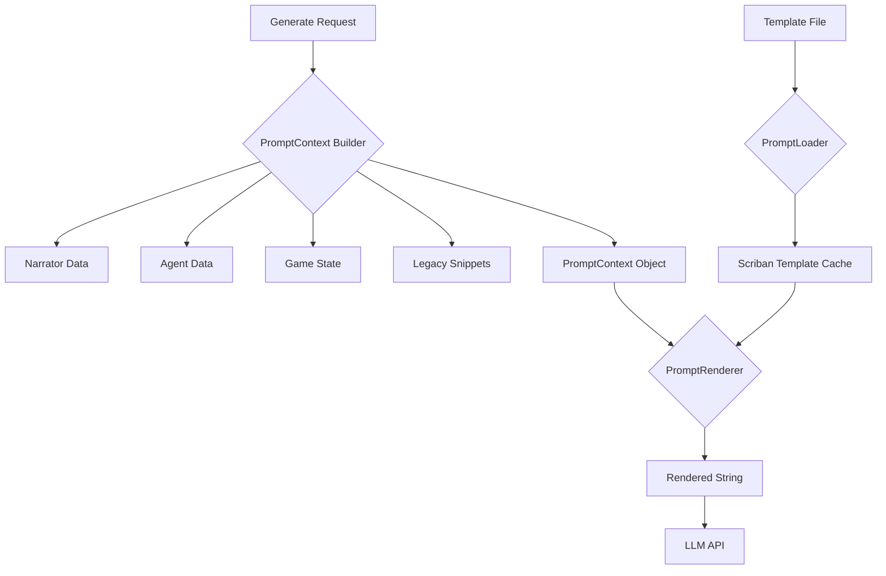

# 提示词系统 Scriban 化重构计划

## 1. 目标
将现有的基于 `string.Replace` 的硬编码提示词生成系统，重构为基于 **Scriban** 模板引擎的动态生成系统。这将提高提示词的可维护性、可读性，并允许更复杂的逻辑（如条件分支、循环）直接在模板文件中实现。

## 2. 核心架构设计

### 2.1 依赖引入
由于项目目前缺少 `Scriban` 库，必须先引入它。
- **Action**: 用户需手动下载 `Scriban.dll` (Compatible with .NET Framework 4.7.2) 并放入 `The Second Seat/Assemblies/` 目录。

### 2.2 数据模型 (PromptContext)
创建一个统一的上下文对象，包含渲染提示词所需的所有数据。

```csharp
public class PromptContext
{
    // 叙事者信息 (Name, Label, Biography, VisualTags)
    public NarratorInfo Narrator { get; set; }
    
    // 代理/玩家关系信息 (Affinity, Mood, DialogueStyle)
    public AgentInfo Agent { get; set; }
    
    // 游戏状态 (Wealth, Population, Threats)
    public GameInfo Game { get; set; }
    
    // 设置与元数据 (DifficultyMode, ModSettings)
    public MetaInfo Meta { get; set; }
    
    // 遗留兼容层：用于存放目前通过复杂 C# 逻辑生成的文本块
    // 在完全重构前，这些块仍由 C# 生成并传入
    public Dictionary<string, string> Snippets { get; set; } 
}
```

### 2.3 渲染器 (PromptRenderer)
创建一个静态工具类，负责加载模板并使用 `PromptContext` 进行渲染。

- **功能**:
  - 封装 Scriban 的 `Template.Parse` 和 `Render`。
  - 配置 `MemberRenamer` 以支持 `{{ narrator.name }}` 这种 snake_case 或 camelCase 风格。
  - 实现自定义 `ITemplateLoader` 以支持 `{{ include 'filename' }}` 语法，复用现有的 `PromptLoader.Load` 逻辑。

### 2.4 模板文件重构
将现有的 `.txt` 模板转换为支持 Scriban 语法的模板。

- **SystemPrompt_Master.txt**:
  - 旧: `{{IdentitySection}}`
  - 新: `{{ snippets.identity_section }}` (初期) -> `{{ include 'Identity_Core' }}` (后期)
  - 逻辑控制: `{{ if meta.difficulty == 'Engineer' }}...{{ end }}`

## 3. 实施步骤 (Todo List)

### Phase 1: 基础设施建设
- [x] **依赖**: 用户手动添加 `Scriban.dll` 到项目引用。
- [x] **模型**: 创建 `TheSecondSeat.PersonaGeneration.Scriban.PromptContext` 及相关子类。
- [x] **加载器**: 创建 `ModPromptTemplateLoader` 实现 Scriban 的 `ITemplateLoader` 接口。
- [x] **渲染器**: 创建 `PromptRenderer` 类。

### Phase 2: 模板迁移 (Event Director)
- [x] **模板创建**: 创建 `SystemPrompt_EventDirector_Scriban.txt`，使用 Scriban 语法 (`{{ narrator.name }}`, `{{ agent.affinity }}`, `{{ include 'Event_*' }}`)。
- [x] **子模板修复** (2026-01-18): 修复 `Event_Identity.txt` 和 `Event_Context.txt` 中的旧占位符，使其兼容 Scriban。
  - `{{NarratorName}}` → `{{ narrator.name }}`
  - `{{Affinity}}` → `{{ agent.affinity | math.round 0 }}`
  - `{{DifficultyMode}}` → `{{ meta.difficulty_mode }}`
- [x] **逻辑**: 修改 `SystemPromptGenerator.GenerateEventDirectorPrompt`，构建 `PromptContext` 并调用 `PromptRenderer`。
- [ ] **验证**: 在游戏中触发 Event Director 逻辑，检查生成的 Prompt 是否正确。

### Phase 3: 全面迁移 (Master Prompt)
- [x] **模板创建**: 创建 `SystemPrompt_Master_Scriban.txt`，使用 Scriban 语法和 `{{ include }}` 指令。
- [x] **逻辑**: 修改 `SystemPromptGenerator.GenerateSystemPrompt` 使用 Scriban 渲染。
- [x] **子模板审查** (2026-01-19): 审查了所有子模板文件：
  - `Narrator_*.txt` - 纯文本，无需动态变量，保持原状 ✅
  - `Relationship_*.txt` - 纯文本，无需动态变量，保持原状 ✅
  - `OutputFormat_*.txt` - 纯文本，无需动态变量，保持原状 ✅
- [x] **清理决策** (2026-01-19): 
  - `GenerateSystemPrompt` 和 `GenerateEventDirectorPrompt` 已完全迁移到 Scriban ✅
  - `GenerateCompactSystemPrompt` 保留 `string.Replace` 实现 ✅
    - 原因：Compact 版本的设计目标是性能优化，`string.Replace` 比 Scriban 解析更快
    - `SystemPrompt_Compact.txt` 使用简单的 `{{Variable}}` 占位符，无需复杂模板逻辑

## 4. 风险与注意事项
- **性能**: Scriban 解析模板有一定开销。应利用 `PromptLoader` 的缓存机制缓存解析后的 `Template` 对象，而不仅仅是文本内容。
- **兼容性**: 确保新的模板语法不破坏现有的用户自定义提示词（如果用户覆盖了文件）。建议在版本更新说明中强调提示词系统的变更。
- **错误处理**: 模板渲染错误（如变量缺失）不应导致游戏崩溃，应有 try-catch 保护并输出错误日志。

## 5. Mermaid 流程图



## 6. Scriban 模板变量参考

### 6.1 Narrator 对象 (`{{ narrator.* }}`)
| 属性 | 类型 | Scriban 语法 | 说明 |
|------|------|--------------|------|
| `name` | string | `{{ narrator.name }}` | 叙事者名称 |
| `label` | string | `{{ narrator.label }}` | 本地化显示名 |
| `biography` | string | `{{ narrator.biography }}` | 传记/背景故事 |
| `visual_tags` | list | `{{ narrator.visual_tags }}` | 视觉标签 |
| `descent_animation` | string | `{{ narrator.descent_animation }}` | 降临动画类型 |
| `personality_tags` | list | `{{ narrator.personality_tags }}` | 人格标签（病娇、傲娇等） |
| `tone_tags` | list | `{{ narrator.tone_tags }}` | 语气标签 |
| `forbidden_words` | list | `{{ narrator.forbidden_words }}` | 禁用词 |
| `special_abilities` | list | `{{ narrator.special_abilities }}` | 特殊能力 |
| `mercy_level` | float | `{{ narrator.mercy_level }}` | 仁慈度 (0-1) |
| `chaos_level` | float | `{{ narrator.chaos_level }}` | 混乱度 (0-1) |
| `dominance_level` | float | `{{ narrator.dominance_level }}` | 强势度 (0-1) |

### 6.2 Agent 对象 (`{{ agent.* }}`)
| 属性 | 类型 | Scriban 语法 | 说明 |
|------|------|--------------|------|
| `affinity` | float | `{{ agent.affinity \| math.round 0 }}` | 好感度 (-100~100) |
| `mood` | string | `{{ agent.mood }}` | 当前心情 |
| `dialogue_style.formality` | float | `{{ agent.dialogue_style.formality }}` | 正式度 |
| `dialogue_style.emotional` | float | `{{ agent.dialogue_style.emotional }}` | 情感表达 |
| `dialogue_style.verbosity` | float | `{{ agent.dialogue_style.verbosity }}` | 冗长度 |
| `dialogue_style.humor` | float | `{{ agent.dialogue_style.humor }}` | 幽默度 |
| `dialogue_style.sarcasm` | float | `{{ agent.dialogue_style.sarcasm }}` | 讽刺度 |

### 6.3 Meta 对象 (`{{ meta.* }}`)
| 属性 | 类型 | Scriban 语法 | 说明 |
|------|------|--------------|------|
| `difficulty_mode` | string | `{{ meta.difficulty_mode }}` | 难度模式 (Assistant/Opponent/Engineer) |
| `language_instruction` | string | `{{ meta.language_instruction }}` | 语言指令 |
| `mod_settings_prompt` | string | `{{ meta.mod_settings_prompt }}` | 用户自定义提示词 |

### 6.4 Snippets 字典 (`{{ snippets.* }}`)
| 键 | Scriban 语法 | 说明 |
|----|--------------|------|
| `identity_section` | `{{ snippets.identity_section }}` | 身份描述块 |
| `personality_section` | `{{ snippets.personality_section }}` | 人格描述块 |
| `philosophy` | `{{ snippets.philosophy }}` | 难度模式哲学 |
| `tool_box_section` | `{{ snippets.tool_box_section }}` | 工具/输出格式 |
| `romantic_instructions` | `{{ snippets.romantic_instructions }}` | 恋爱模式指令 |
| `log_diagnosis` | `{{ snippets.log_diagnosis }}` | 日志诊断指令 |

### 6.5 常用 Scriban 过滤器
| 过滤器 | 用法 | 说明 |
|--------|------|------|
| `math.round` | `{{ value \| math.round 0 }}` | 四舍五入 |
| `string.upcase` | `{{ name \| string.upcase }}` | 转大写 |
| `array.join` | `{{ tags \| array.join ", " }}` | 连接数组 |

### 6.6 条件语法示例
```scriban
{{ if agent.affinity > 60 }}
高好感模式内容
{{ else if agent.affinity < -20 }}
低好感模式内容
{{ else }}
中立模式内容
{{ end }}
```

---

## 7. 调试器界面参考

### 7.1 现有调试窗口
| 窗口 | 文件 | 功能 |
|------|------|------|
| `Dialog_FavorabilityDebug` | `UI/DebugWindows.cs` | 好感度调整、等级预览 |
| `Dialog_ExpressionDebug` | `UI/DebugWindows.cs` | 表情切换、立绘预览 |
| `RimAgentDebugWindow` | `RimAgent/UI/RimAgentDebugWindow.cs` | Agent 状态、请求历史、Token 统计 |
| `PromptManagementWindow` | `UI/PromptManagementWindow.cs` | 提示词文件管理 |

### 7.2 建议的增强功能

#### 7.2.1 System Prompt 预览面板
- **位置**: 可在 `RimAgentDebugWindow` 中添加新 Tab
- **功能**:
  - 显示当前渲染后的完整 System Prompt
  - 显示 Token 估算
  - 一键刷新（重新渲染）
  - 对比 Master Prompt 和 EventDirector Prompt

#### 7.2.2 PromptContext 数据视图
- **功能**:
  - 实时显示 `NarratorInfo`、`AgentInfo`、`MetaInfo` 的当前值
  - 显示 `Snippets` 字典的所有键值对
  - 支持搜索和过滤

#### 7.2.3 模板渲染测试器
- **功能**:
  - 输入自定义 Scriban 模板片段
  - 使用当前 PromptContext 渲染
  - 显示渲染结果或错误信息

### 7.3 调试器入口

可通过以下方式打开调试器：
- 开发者模式菜单
- 叙事者面板右键菜单
- 设置界面的调试按钮

---

## 8. 更新日志

### 2026-01-18
- **修复**: `Event_Identity.txt` - 将 `{{NarratorName}}` 替换为 `{{ narrator.name }}`
- **修复**: `Event_Context.txt` - 将 `{{Affinity}}` 替换为 `{{ agent.affinity | math.round 0 }}`，将 `{{DifficultyMode}}` 替换为 `{{ meta.difficulty_mode }}`
- **验证**: 检查了 `NarratorManager.cs` 和 `SystemPromptGenerator.cs` 中 Event Director 的初始化和更新逻辑，确认数据流正确。

### 2026-01-19
- **Phase 3 子模板审查完成**:
  - 验证所有 `Narrator_*.txt` 文件均为纯文本，不需要 Scriban 变量
  - 验证所有 `Relationship_*.txt` 文件均为纯文本，不需要 Scriban 变量
  - 确认 `PromptContext.cs` 中的数据模型完整，支持 snake_case 访问（如 `narrator.name`、`agent.affinity`）
  - 确认 `PromptRenderer.cs` 正确配置了 `ITemplateLoader` 以支持 `{{ include '...' }}` 语法
