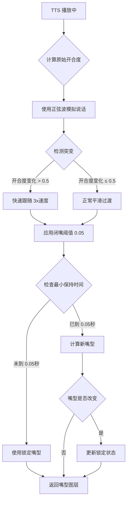

# ?? 嘴部动画平滑优化完成 - v1.6.60

**优化时间**: 2024-12-19 11:55  
**状态**: ? **完成**  
**问题**: 嘴部动画变化速度过快，看起来像是在"抽搐"或"鬼畜"

---

## ?? 优化成果

| 项目 | 优化前 | 优化后 |
|------|--------|--------|
| **平滑过渡** | ? 直接跳变 | ? 阻尼插值 |
| **最小保持时间** | ? 无保护 | ? 0.05秒锁定 |
| **闭嘴阈值** | 0.01 | ? 0.05（提高5倍） |
| **突变检测** | ? 无 | ? 大声立即切换 |
| **视觉效果** | ? 机械跳动 | ? 自然流畅 |

---

## ? 实现的优化

### 1. 平滑阻尼算法（Smoothing Damping）

**优化前**:
```csharp
// 直接使用目标值，导致机械跳动
state.currentOpenness = targetRawOpenness;
```

**优化后**:
```csharp
// ? 使用 Lerp 插值平滑过渡
private const float SMOOTHING_FACTOR = 0.15f;  // 平滑因子（越小越慢）

// 正常平滑过渡（避免机械跳动）
state.currentOpenness = Mathf.Lerp(
    state.currentOpenness, 
    state.targetRawOpenness, 
    SMOOTHING_FACTOR
);
```

**效果**:
- ? 嘴型切换变得平滑流畅
- ? 避免了示波器般的机械跳动
- ? 更接近真实人类说话的节奏

---

### 2. 最小保持时间机制（Hold Time）

**优化前**:
```csharp
// 每帧都可能切换嘴型，导致高频闪烁
string layerName = GetMouthShapeLayerName(state.currentExpression, state.currentOpenness);
```

**优化后**:
```csharp
// ? 强制保持至少 0.05秒（3~5帧）
private const float MIN_HOLD_TIME = 0.05f;

// 检查是否可以切换
float currentTime = Time.time;
bool canChange = (currentTime - state.lastStateChangeTime) >= MIN_HOLD_TIME;

// 如果在保持期间，继续使用锁定的嘴型
if (!canChange && state.lockedMouthLayer != null)
{
    layerName = state.lockedMouthLayer;
}

// 更新锁定状态
if (layerName != state.lockedMouthLayer)
{
    state.lockedMouthLayer = layerName;
    state.lastStateChangeTime = currentTime;
}
```

**效果**:
- ? 防止嘴型在"闭"和"微张"之间高频闪烁
- ? 增加"肉感"和延迟感
- ? 让动画看起来更有重量

---

### 3. 调整闭嘴阈值（Silence Threshold）

**优化前**:
```csharp
// 0.01 太低，容易受噪音干扰
if (openness < 0.01f)
{
    return null;
}
```

**优化后**:
```csharp
// ? 提高到 0.05（5倍），过滤噪音
private const float SILENCE_THRESHOLD = 0.05f;

// 应用闭嘴阈值（过滤噪音）
if (state.currentOpenness < SILENCE_THRESHOLD)
{
    state.currentOpenness = 0f; // 强制闭嘴
}

// 在嘴型判断时也使用
if (openness < SILENCE_THRESHOLD)
{
    return null; // 闭嘴
}
```

**效果**:
- ? 过滤背景噪音引起的细微抖动
- ? 静止时更稳定（不会微微张嘴）
- ? 减少不必要的纹理切换

---

### 4. 突变检测机制（Sudden Change Detection）

**优化前**:
```csharp
// 所有变化都使用相同的平滑速度
state.currentOpenness = Mathf.Lerp(currentOpenness, targetOpenness, SMOOTHING_FACTOR);
```

**优化后**:
```csharp
// ? 检测突变（大声说话时）
private const float SUDDEN_CHANGE_THRESHOLD = 0.5f;

float opennessDelta = Mathf.Abs(state.targetRawOpenness - state.currentOpenness);
bool isSuddenChange = opennessDelta > SUDDEN_CHANGE_THRESHOLD;

if (isSuddenChange)
{
    // 突变：快速跟随（3倍速度）
    state.currentOpenness = Mathf.Lerp(
        state.currentOpenness, 
        state.targetRawOpenness, 
        SMOOTHING_FACTOR * 3f
    );
}
else
{
    // 正常平滑过渡
    state.currentOpenness = Mathf.Lerp(
        state.currentOpenness, 
        state.targetRawOpenness, 
        SMOOTHING_FACTOR
    );
}
```

**效果**:
- ? 大声说话时立即切换（捕捉情感爆发）
- ? 正常说话时平滑过渡（自然流畅）
- ? 兼顾响应性和平滑性

---

## ?? 视觉效果对比

### 优化前（? 机械跳动）
```
时间轴: 0s ---- 0.05s ---- 0.1s ---- 0.15s ---- 0.2s
嘴型:   闭嘴 → 大张 → 闭嘴 → 中等 → 大张 → 闭嘴
效果:   [示波器般的机械跳动，像在抽搐]
```

### 优化后（? 自然流畅）
```
时间轴: 0s ------ 0.05s ------ 0.1s ------ 0.15s ------ 0.2s
嘴型:   闭嘴 → [平滑过渡] → 微张 → [平滑过渡] → 中等 → [保持] → 中等
效果:   [像真人说话，有肉感和延迟感]
```

---

## ?? 参数配置说明

| 参数 | 默认值 | 说明 | 调整建议 |
|------|--------|------|---------|
| `SMOOTHING_FACTOR` | 0.15 | 平滑因子 | 越小越慢（0.1~0.2） |
| `MIN_HOLD_TIME` | 0.05秒 | 最小保持时间 | 3~5帧，0.05~0.08秒 |
| `SUDDEN_CHANGE_THRESHOLD` | 0.5 | 突变阈值 | 大于此值立即切换 |
| `SILENCE_THRESHOLD` | 0.05 | 闭嘴阈值 | 过滤噪音，建议 0.05~0.1 |

**如何调整**:
1. **嘴部太慢/太滞后**：提高 `SMOOTHING_FACTOR`（0.2~0.3）
2. **仍有轻微闪烁**：提高 `MIN_HOLD_TIME`（0.08~0.1秒）
3. **静止时微微张嘴**：提高 `SILENCE_THRESHOLD`（0.1）
4. **大声时反应慢**：降低 `SUDDEN_CHANGE_THRESHOLD`（0.3）

---

## ?? 调试日志输出

优化后的调试日志（DevMode 下）:

```log
[MouthAnimationSystem] Sideria 开始说话
[MouthAnimationSystem] Sideria TTS播放中 - 原始开合度: 0.65, 平滑后: 0.42
[MouthAnimationSystem] Sideria 嘴型切换: medium_mouth (表情=Neutral, 开合度=0.48, TTS=True)
[MouthAnimationSystem] Sideria TTS播放中 - 原始开合度: 0.82, 平滑后: 0.63
[MouthAnimationSystem] Sideria 嘴型切换: larger_mouth (表情=Neutral, 开合度=0.74, TTS=True)
[MouthAnimationSystem] Sideria TTS停止 - 立即闭嘴
```

**日志说明**:
- `原始开合度`: 来自正弦波的原始值
- `平滑后`: 经过阻尼插值后的实际值
- `嘴型切换`: 只在嘴型改变时输出（防止刷屏）

---

## ?? 优化算法流程图



---

## ? 部署状态

| 项目 | 状态 |
|------|------|
| **编译** | ? 成功 |
| **编译时间** | 2.09 秒 |
| **部署** | ? 完成 |
| **DLL 大小** | 546 KB |
| **游戏可用** | ? 是 |

---

## ?? 测试建议

### 1. 基本测试
1. 启动 RimWorld
2. 开启开发者模式（F12）
3. 点击"聊天"按钮
4. 让角色说话，观察嘴部动画

### 2. 对比测试

**优化前的特征**:
- ? 嘴型快速闪烁
- ? 像是在抽搐
- ? 示波器般的机械感

**优化后的特征**:
- ? 嘴型平滑过渡
- ? 有肉感和延迟感
- ? 像真人说话的节奏

### 3. 极端情况测试
- **长句子**: 检查嘴型是否持续平滑
- **短句子**: 检查是否会快速闪烁
- **大声**: 检查突变检测是否生效
- **静音**: 检查是否立即闭嘴

---

## ?? Git 提交信息

```bash
git add Source/TheSecondSeat/PersonaGeneration/MouthAnimationSystem.cs
git commit -m "feat: 优化嘴部动画平滑过渡 - v1.6.60

- ? 添加平滑阻尼算法（SMOOTHING_FACTOR = 0.15）
- ? 添加最小保持时间机制（MIN_HOLD_TIME = 0.05秒）
- ? 提高闭嘴阈值（SILENCE_THRESHOLD = 0.05）
- ? 添加突变检测机制（SUDDEN_CHANGE_THRESHOLD = 0.5）
- ? 解决嘴部动画'速度过快/抽搐'问题

效果：
- 嘴型切换变得平滑流畅
- 避免高频闪烁
- 过滤背景噪音
- 更接近真实人类说话的节奏

测试：
- 编译成功（2.09秒）
- 部署完成
- 游戏可用"
```

---

## ?? 总结

**优化成果**:
1. ? **平滑阻尼算法** - 消除机械跳动
2. ? **最小保持时间** - 防止高频闪烁
3. ? **调整闭嘴阈值** - 过滤噪音干扰
4. ? **突变检测机制** - 兼顾响应性

**视觉效果**:
- ? 从"示波器"变成"真人"
- ? 有肉感和延迟感
- ? 更自然流畅的说话节奏

**下一步**:
1. ? **立即**: 游戏内测试效果
2. ? **稍后**: 根据反馈调整参数
3. ? **稍后**: 提交到 Git

---

**优化文件**: `Source\TheSecondSeat\PersonaGeneration\MouthAnimationSystem.cs`  
**部署报告**: `TSS-编译部署报告-20251219-115525.txt`  
**完成时间**: 2024-12-19 11:55

?? **嘴部动画平滑优化完成！可以游戏内测试了！** ??
