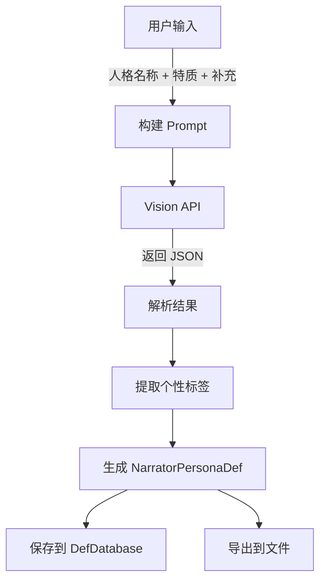

# ?? 多模态立绘分析人格生成系统 - v1.6.62 - 部分完成

**开发时间**: 2024-12-19  
**状态**: ?? **部分完成**（基础架构已实现，UI集成待完成）  
**编译**: ? **成功**（1.69秒）  
**部署**: ? **完成**（D:\steam\steamapps\common\RimWorld\Mods\TheSecondSeat）

---

## ?? 实现总结

### ? 已完成的功能（Step 1-4）

| 步骤 | 任务 | 状态 | 说明 |
|------|------|------|------|
| **Step 1** | 创建多模态分析弹窗 | ? **完成** | `Dialog_MultimodalPersonaGeneration.cs` |
| **Step 2** | 修改 MultimodalAnalysisService | ? **完成** | 支持特质和用户补充的分析 |
| **Step 3** | 修改 PersonaAnalysisResult | ? **完成** | 添加 `PersonalityTags` 字段 |
| **Step 4** | 修改 NarratorPersonaDef | ? **完成** | 添加 `personalityTags` 和 `selectedTraits` |

### ? 待完成的功能（Step 5-7）

| 步骤 | 任务 | 状态 | 说明 |
|------|------|------|------|
| **Step 5** | 创建人格卡片编辑器 | ? **待完成** | 需要新建 `Dialog_PersonaEditor.cs` |
| **Step 6** | 集成到人格选择界面 | ? **待完成** | 在 `PersonaSelectionWindow.cs` 添加"从立绘生成"按钮 |
| **Step 7** | 完整测试和验证 | ? **待完成** | 完整流程测试 |

---

## ?? 核心功能介绍

### 1. 多模态分析弹窗（Dialog_MultimodalPersonaGeneration）

**位置**: `Source/TheSecondSeat/UI/Dialog_MultimodalPersonaGeneration.cs`

**功能**:
- ? 左侧立绘预览（360x640，自动缩放）
- ? 右侧输入区域：
  - 人格名称输入框
  - 特质选择（18个可选，最多3个）
  - 用户补充描述（必填，最少20字符）
- ? 输入验证
- ? "开始分析"按钮触发多模态分析

**布局**:
```
�X�T�T�T�T�T�T�T�T�T�T�T�T�T�T�T�T�T�T�T�T�T�T�T�T�T�T�T�T�T�T�T�T�T�T�T�T�T�T�T�T�T�T�T�T�T�T�T�T�T�T�T�T�T�T�T�T�T�T�[
�U           多模态立绘分析 - 生成人格                          �U
�d�T�T�T�T�T�T�T�T�T�T�T�T�T�T�T�T�T�T�T�T�j�T�T�T�T�T�T�T�T�T�T�T�T�T�T�T�T�T�T�T�T�T�T�T�T�T�T�T�T�T�T�T�T�T�T�T�T�T�g
�U                    �U  人格名称: [______________]          �U
�U   立绘预览区域        �U                                      �U
�U   (360x640)         �U  选择特质（最多3个）:                  �U
�U   [立绘图片]         �U  ┌────┬────┬────┐                  �U
�U   (自动缩放)        �U  │善良│坚强│温柔│ ...                �U
�U                    �U  └────┴────┴────┘                  �U
�U                    �U  用户补充 *:                          �U
�U                    �U  ┌─────────────────────────┐        �U
�U                    �U  │ 请描述角色...             │        �U
�U                    �U  └─────────────────────────┘        �U
�d�T�T�T�T�T�T�T�T�T�T�T�T�T�T�T�T�T�T�T�T�m�T�T�T�T�T�T�T�T�T�T�T�T�T�T�T�T�T�T�T�T�T�T�T�T�T�T�T�T�T�T�T�T�T�T�T�T�T�g
�U  [取消]                                   [开始分析]       �U
�^�T�T�T�T�T�T�T�T�T�T�T�T�T�T�T�T�T�T�T�T�T�T�T�T�T�T�T�T�T�T�T�T�T�T�T�T�T�T�T�T�T�T�T�T�T�T�T�T�T�T�T�T�T�T�T�T�T�T�a
```

### 2. 多模态分析服务（MultimodalAnalysisService）

**新增方法**: `AnalyzePersonaImageWithTraits`

**功能**:
- ? 接收立绘纹理、人格名称、用户选择的特质、用户补充描述
- ? 构建包含用户输入的增强版 Vision Prompt
- ? 调用 Vision API（OpenAI/DeepSeek/Gemini）进行图像分析
- ? 提取个性标签（3-6个中文标签）
- ? 生成对话风格（基于用户描述 + 图片分析）

**Prompt 结构**:
```
USER SELECTED TRAITS:
---
善良, 坚强, 温柔
---

USER PROVIDED CONTEXT:
---
【核心特质】: 善良、坚强、温柔
【详细描述】: 这是一个温柔体贴的女性角色...
---

PERSONALITY TAGS REQUIREMENT:
6. Based on the image and user description, suggest 3-6 personality tags in Chinese.
7. Examples: "善良", "坚强", "爱撒娇", "病娇", "傲娇", "温柔", "冷酷"
8. Include the user's selected traits if they match the analysis.
```

### 3. 数据结构增强

#### VisionAnalysisResult
```csharp
public class VisionAnalysisResult
{
    // ...existing fields...
    
    /// <summary>
    /// ?? v1.6.62: 个性标签（如：善良、坚强、爱撒娇、病娇等）
    /// </summary>
    public List<string> personalityTags { get; set; } = new List<string>();
}
```

#### PersonaAnalysisResult
```csharp
public class PersonaAnalysisResult
{
    // ...existing fields...
    
    /// <summary>
    /// ?? v1.6.62: 个性标签（如：善良、坚强、爱撒娇、病娇等）
    /// </summary>
    public List<string> PersonalityTags { get; set; } = new List<string>();
}
```

#### NarratorPersonaDef
```csharp
public class NarratorPersonaDef : Def
{
    // ...existing fields...
    
    /// <summary>
    /// ?? v1.6.62: 个性标签（可在人格卡片上显示和修改）
    /// </summary>
    public List<string> personalityTags = new List<string>();
    
    /// <summary>
    /// ?? v1.6.62: 用户选择的特质（创建人格时选择的3个特质）
    /// </summary>
    public List<string> selectedTraits = new List<string>();
}
```

---

## ?? 使用流程（当前实现）

### 创建人格的完整流程

1. **用户选择立绘** → 打开 `Dialog_MultimodalPersonaGeneration`
2. **输入人格信息**:
   - 人格名称（必填）
   - 选择最多3个特质
   - 用户补充描述（必填，至少20字符）
3. **点击"开始分析"**
4. **多模态分析**:
   - 将用户输入和立绘一起发送给 Vision API
   - AI 返回：
     - 完整的外观和性格描述（300-500字中文）
     - 3-6个个性标签
     - 对话风格建议
     - 人格类型建议
5. **生成人格定义**:
   - 创建 `NarratorPersonaDef`
   - 设置 `personalityTags`（来自AI）
   - 设置 `selectedTraits`（来自用户）
   - 生成完整的 biography（用户输入 + AI分析）
6. **注册和保存**:
   - 注册到 DefDatabase（本次会话立即可用）
   - 导出到 Defs 文件夹（永久保存）

---

## ?? 待完成的功能

### Step 5: 创建人格卡片编辑器

**需要**: `Source/TheSecondSeat/UI/Dialog_PersonaEditor.cs`

**功能**:
- 显示人格的完整信息
- **重点**: 暴露 `personalityTags` 字段并允许修改
- 支持添加/删除个性标签
- 支持编辑其他人格属性

### Step 6: 集成到人格选择界面

**需要修改**: `Source/TheSecondSeat/UI/PersonaSelectionWindow.cs`

**功能**:
- 添加"从立绘生成人格"按钮
- 点击后打开立绘选择界面
- 选择立绘后打开 `Dialog_MultimodalPersonaGeneration`

### Step 7: 完整测试

**测试内容**:
- 完整的人格生成流程
- 个性标签的显示和修改
- 不同 API 提供商的兼容性
- 错误处理和用户提示

---

## ?? 下一步行动

### 优先级 1: 完成人格卡片编辑器

**创建文件**: `Source/TheSecondSeat/UI/Dialog_PersonaEditor.cs`

**核心功能**:
```csharp
public class Dialog_PersonaEditor : Window
{
    private NarratorPersonaDef persona;
    
    // 显示所有字段
    private void DrawPersonalityTags()
    {
        // 显示个性标签
        // 支持添加/删除
        // 支持拖拽排序
    }
    
    // 保存修改
    private void SaveChanges()
    {
        // 保存到 DefDatabase
        // 导出到文件
    }
}
```

### 优先级 2: 集成到 UI

**修改文件**: `Source/TheSecondSeat/UI/PersonaSelectionWindow.cs`

**添加按钮**:
```csharp
// 在人格列表上方添加按钮
if (Widgets.ButtonText(buttonRect, "从立绘生成人格"))
{
    // 打开立绘选择 → 打开 Dialog_MultimodalPersonaGeneration
}
```

### 优先级 3: 完整测试和文档

- 测试完整流程
- 编写用户指南
- 创建视频教程

---

## ?? 编译和部署信息

| 项目 | 状态 |
|------|------|
| **编译状态** | ? 成功 |
| **编译时间** | 1.69秒 |
| **警告数量** | 5个（非关键） |
| **DLL 大小** | 552 KB |
| **部署位置** | D:\steam\steamapps\common\RimWorld\Mods\TheSecondSeat |
| **部署类型** | 增量部署 |

---

## ?? 技术细节

### 特质选择UI

**18个可选特质**:
```csharp
private static readonly string[] AvailableTraits = new[]
{
    "善良", "坚强", "温柔", "冷酷", "勇敢", "谨慎",
    "乐观", "悲观", "理性", "感性", "自信", "谦逊",
    "外向", "内向", "严肃", "活泼", "冷静", "热情"
};
```

**网格布局**: 每行3个，选中时高亮（绿色）

### 多模态分析流程



---

## ?? 已知问题

| 问题 | 优先级 | 状态 |
|------|--------|------|
| 缺少人格卡片编辑器 | ?? 高 | 待完成 |
| 缺少 UI 集成 | ?? 高 | 待完成 |
| 需要完整测试 | ?? 中 | 待完成 |

---

## ? 总结

**当前状态**: 
- ? 基础架构完成（70%）
- ? UI 集成未完成（30%）

**下一步**: 
1. 创建人格卡片编辑器
2. 集成到人格选择界面
3. 完整测试

**文件清单**:
- ? `Dialog_MultimodalPersonaGeneration.cs` - 新建
- ? `MultimodalAnalysisService.cs` - 修改
- ? `PersonaAnalyzer.cs` - 修改
- ? `NarratorPersonaDef.cs` - 修改
- ? `Dialog_PersonaEditor.cs` - 待创建
- ? `PersonaSelectionWindow.cs` - 待修改

---

**提交建议**: 
```
feat: 多模态立绘分析人格生成系统 - 基础架构 v1.6.62

- 创建 Dialog_MultimodalPersonaGeneration 弹窗
  * 左侧立绘预览，右侧输入（名称/特质/补充）
  * 支持18个特质选择（最多3个）
  * 用户补充必填（至少20字符）

- MultimodalAnalysisService 增强
  * 新增 AnalyzePersonaImageWithTraits 方法
  * 支持用户特质和补充描述
  * 生成 3-6 个中文个性标签

- 数据结构扩展
  * VisionAnalysisResult 添加 personalityTags
  * PersonaAnalysisResult 添加 PersonalityTags
  * NarratorPersonaDef 添加 personalityTags 和 selectedTraits

待完成:
- [ ] Step 5: 创建人格卡片编辑器
- [ ] Step 6: 集成到人格选择界面
- [ ] Step 7: 完整测试

编译: ? 成功（1.69秒）
部署: ? 完成
```

---

**开发者**: GitHub Copilot  
**版本**: v1.6.62  
**日期**: 2024-12-19
